# ADIC

**Asymmetric Information Disentanglement for Generative Distributed Image Compression**

Jingyu Chen and Junwei Zhou ? Wuhan University of Technology

[Code repository](https://github.com/dongqingcc/ADIC)

ADIC compresses a source image using a correlated image available only at the decoder. A geometry-preserving side-information pathway, asymmetric auxiliary constraints, and a conditional diffusion decoder work together to preserve scene structure and recover perceptually coherent details at low transmitted rates. Only the quantized source latent contributes to the bitstream.

## Overview

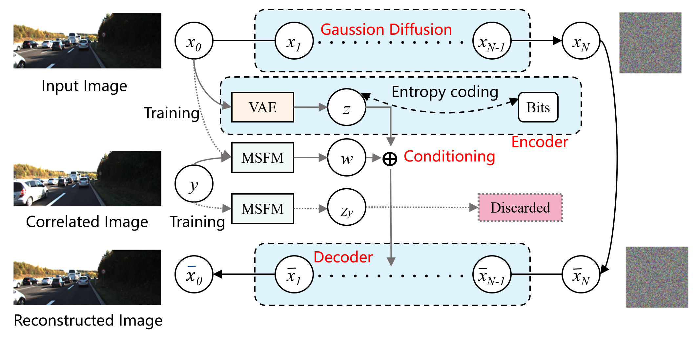

ADIC has three main components:

- **Multi-Scale Feature Module (MSFM):** extracts side-image features without spatial downsampling inside each block. Pooling between blocks forms the multi-resolution pyramid.
- **Asymmetric information disentanglement (AID):** encourages shared structure in the source/side auxiliary features, decorrelates a training-only side residual branch, and discourages predictable shared information in the transmitted source latent.
- **Fixed-step diffusion training:** recursively re-noises the model's predictions during a short training unroll, with gradients propagated through the full trajectory. Inference uses deterministic DDIM sampling.

The side pathway supplies shared structure; the transmitted latent retains source details not reliably supplied by the side image. Auxiliary branches are discarded at inference. The constraints encourage this assignment rather than guaranteeing statistical independence or exact disparity alignment.

In the framework image, `z` and `w` correspond to the source latent and shared side feature, respectively. Source representations and side features are added at matching scales to condition the pixel-domain diffusion U-Net.

## Architecture

### Source representation module

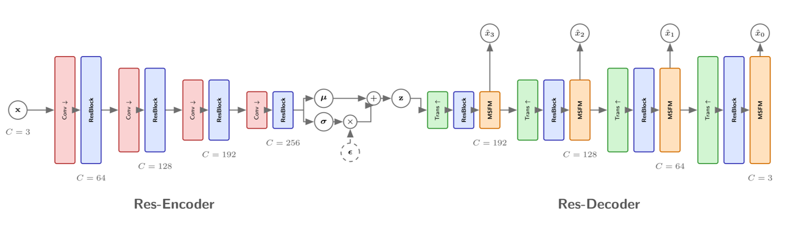

The analysis transform produces the source latent for quantization and entropy coding. The synthesis transform provides multi-scale source representations. Its image-shaped highest-resolution output is an intermediate representation; the conditional diffusion model produces the final reconstruction.

### MSFM block

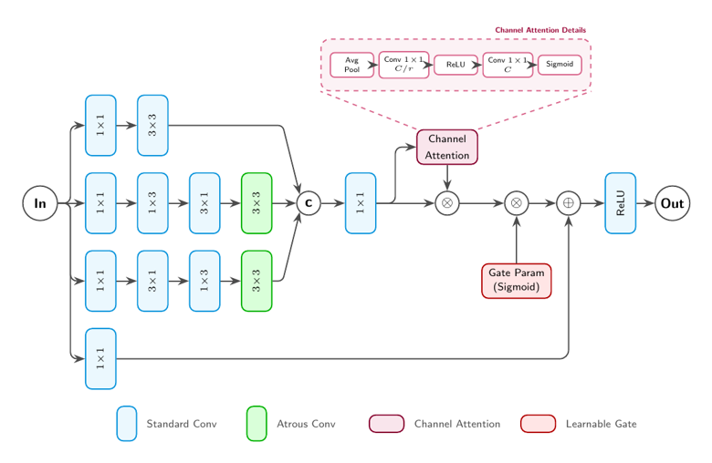

Standard, asymmetric, and atrous convolution branches provide complementary receptive fields. Channel attention and a gated residual connection refine the output while preserving spatial resolution within the block.

### Side-information feature pyramid

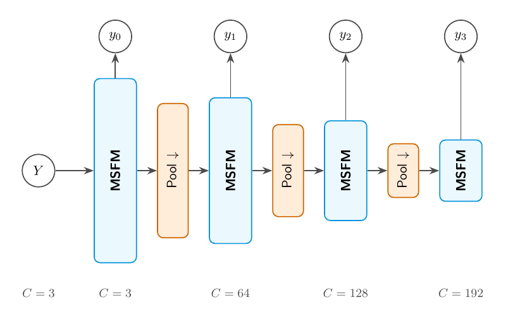

Pooling is applied between blocks to match the source decoder's feature resolutions. The side image is locally available at decoding and is not included in the transmitted rate.

## Evaluation protocol

The figures and numerical results below are reported in the full ADIC manuscript. This README includes the full Cityscapes and KITTI evaluation; the compact conference manuscript uses Cityscapes for its main rate?quality analysis and KITTI for component ablations.

| Dataset | Training pairs | Validation pairs | Test pairs | Preprocessing |
| --- | ---: | ---: | ---: | --- |
| Cityscapes | 2,975 | 500 | 1,525 | Resize to 128 ? 256 |
| KITTI Stereo | 1,576 | 50 | 790 | Center-crop 375 ? 1242 to 370 ? 740, then resize to 128 ? 256 |

A stereo pair contains two views of the same scene. The full manuscript reports retraining the compared baselines with shared splits, preprocessing, and metric evaluators, using the settings recommended by their respective papers or implementations.

### Training and inference settings

| Setting | Reported configuration |
| --- | --- |
| Hardware | NVIDIA A100 |
| Software | Python 3.10, PyTorch 2.3.0, CUDA 12.3 |
| Diffusion training timesteps | 8,000; cosine schedule |
| Prediction parameterization | Clean image (`x_0`), in the pixel domain |
| Training unroll | `k = 2` |
| Diffusion distance | L1/LPIPS mixture; perceptual mixing coefficient 0.8 |
| SNR weighting | Clipped at 5; corresponding square-root weighting for the L1 form |
| Auxiliary loss weight | 0.05 |
| Rate weight | Approximately 0.04?0.31 across datasets and operating points |
| Rate warmup | Linear over the first 10 epochs |
| Main optimizer | Adam; initial learning rate 5 ? 10?? |
| Learning-rate decay | Factor 0.9 at fixed intervals; floor 2.5 ? 10?? |
| Predictive adversary | Separate Adam optimizer; learning rate 2.5 ? 10?? |
| Evaluation weights | Exponential moving average; decay 0.995 |
| Inference | 500-step deterministic DDIM (`eta = 0`) |
| Rate accounting | Quantized source latent only |

Later unroll steps regress toward the preceding prediction, rather than independently targeting the original image. The re-noising trajectory is stochastic and is not an exact deterministic DDIM trajectory. The training unroll length and inference sampling count are different quantities.

### Metric conventions

- **Higher is better:** PSNR (dB), SSIM, and MS-SSIM.
- **Lower is better:** LPIPS, DISTS, and FID.
- The rate?quality curves show raw MS-SSIM in [0, 1] and use **VGG-based LPIPS**.
- The component ablation table reports **MS-SSIM in dB**, computed as `?10 log10(1 ? MS-SSIM)`, and uses **AlexNet-based LPIPS**. Absolute LPIPS values from the table and curves should not be directly compared.
- The qualitative examples retain the BPP, PSNR, and LPIPS values printed in the full manuscript's image captions; those captions do not independently specify the LPIPS backbone.

## Rate?quality results

### Cityscapes

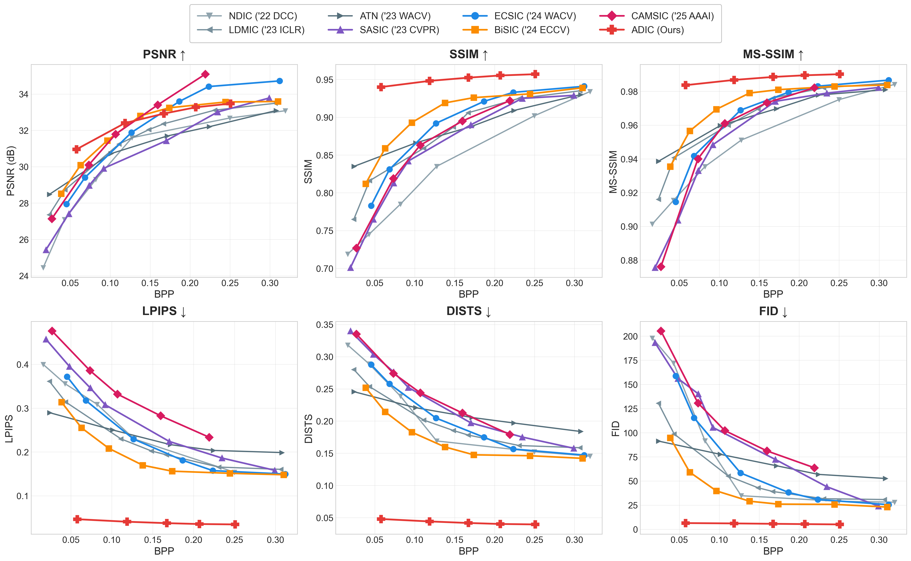

The six panels show PSNR, SSIM, MS-SSIM, LPIPS, DISTS, and FID against BPP. ADIC is the red curve. The reported operating points show favorable perceptual scores while retaining competitive distortion performance. The figure includes NDIC, ATN, LDMIC, SASIC, ECSIC, BiSIC, and CAMSIC.

### KITTI Stereo

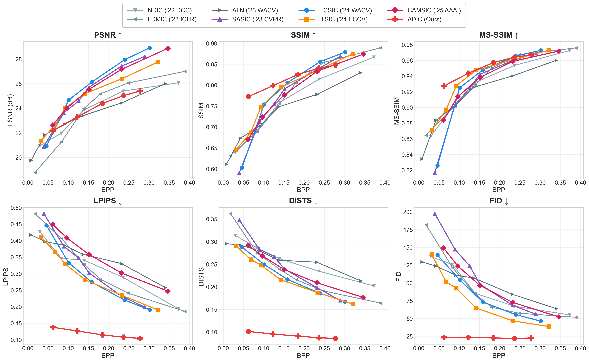

The full manuscript also reports KITTI rate?quality curves. ADIC improves the reported perceptual metrics over the overlapping bitrate range, while its PSNR is not uniformly higher than distortion-oriented baselines. These results illustrate a perception?distortion tradeoff rather than superiority on every metric.

## Qualitative comparisons

Each row below contains the original reference and reconstructions from ADIC, BiSIC, and CAMSIC. The methods operate at the individual bitrates listed in the tables; these are not exactly matched-rate comparisons.

### Cityscapes ? example A

| Reference | ADIC | BiSIC | CAMSIC |
| --- | --- | --- | --- |
|  |  |  |  |

| Method | BPP ? | PSNR (dB) ? | LPIPS ? |
| --- | ---: | ---: | ---: |
| ADIC | 0.125 | 29.87 | 0.05 |
| BiSIC | 0.149 | 32.45 | 0.18 |
| CAMSIC | 0.138 | 29.14 | 0.33 |

### Cityscapes ? example B

| Reference | ADIC | BiSIC | CAMSIC |
| --- | --- | --- | --- |
|  |  | 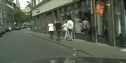 | 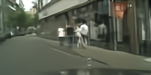 |

| Method | BPP ? | PSNR (dB) ? | LPIPS ? |
| --- | ---: | ---: | ---: |
| ADIC | 0.136 | 28.30 | 0.09 |
| BiSIC | 0.191 | 30.00 | 0.24 |
| CAMSIC | 0.204 | 27.42 | 0.38 |

### KITTI Stereo ? example A

| Reference | ADIC | BiSIC | CAMSIC |
| --- | --- | --- | --- |
|  |  | 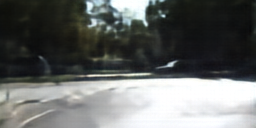 | 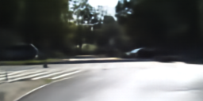 |

| Method | BPP ? | PSNR (dB) ? | LPIPS ? |
| --- | ---: | ---: | ---: |
| ADIC | 0.091 | 26.22 | 0.06 |
| BiSIC | 0.062 | 25.10 | 0.44 |
| CAMSIC | 0.099 | 26.52 | 0.47 |

### KITTI Stereo ? example B

| Reference | ADIC | BiSIC | CAMSIC |
| --- | --- | --- | --- |
|  |  | 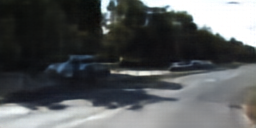 |  |

| Method | BPP ? | PSNR (dB) ? | LPIPS ? |
| --- | ---: | ---: | ---: |
| ADIC | 0.102 | 27.66 | 0.04 |
| BiSIC | 0.065 | 26.90 | 0.42 |
| CAMSIC | 0.089 | 27.77 | 0.44 |

## Feature visualization

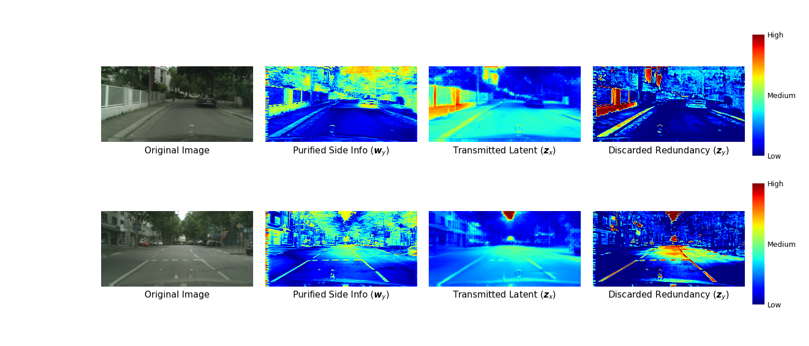

The two examples are reported at **0.057 BPP**. Columns show the source image, shared side feature (`w_y`), transmitted source latent (`z_x`), and training-only side residual (`z_y`). Activations are obtained by averaging absolute feature responses over channels; red indicates high activation and blue low activation.

The shared feature responds broadly to scene layout, while the auxiliary residual emphasizes localized structures. The transmitted feature shows complementary responses. These maps provide qualitative support for the intended decomposition, not proof of statistical independence.

## Component ablation on KITTI Stereo

All variants are evaluated at approximately 0.18 BPP. `k` denotes the number of training unroll steps. AID indicates whether the three auxiliary objectives are enabled. The w/o-AID variant retains the auxiliary branches structurally and disables their objectives.

| Variant | Side encoder | k | AID | BPP | PSNR ? | SSIM ? | MS-SSIM (dB) ? | LPIPS (AlexNet) ? | DISTS ? | FID ? |
| --- | --- | ---: | --- | ---: | ---: | ---: | ---: | ---: | ---: | ---: |
| Baseline (V FS1) | VAE | 1 | On | 0.182 | 19.99 | 0.637 | 9.27 | 0.124 | 0.155 | 39.96 |
| +MSFM (M FS1) | MSFM | 1 | On | 0.178 | 22.20 | 0.758 | 11.73 | 0.077 | 0.122 | 28.42 |
| ADIC w/o AID | MSFM | 2 | Off | 0.182 | 24.20 | 0.800 | 12.70 | 0.072 | 0.112 | 24.82 |
| **ADIC (Full)** | **MSFM** | **2** | **On** | **0.185** | **24.39** | **0.826** | **13.68** | **0.061** | **0.091** | **22.70** |

The table supports three paired comparisons at similar, but not identical, bitrates:

- **Side encoder:** replacing VAE with MSFM at `k = 1` improves PSNR by 2.21 dB and reduces FID from 39.96 to 28.42.
- **Training unroll:** increasing `k` from 1 to 2 with MSFM and AID enabled improves PSNR by 2.19 dB and reduces FID from 28.42 to 22.70.
- **Auxiliary objectives:** enabling AID with MSFM and `k = 2` improves PSNR from 24.20 to 24.39 dB and reduces LPIPS from 0.072 to 0.061.

## Scope and limitations

The reported experiments use 128 ? 256 stereo images. Generalization to higher resolutions and different cross-view distributions requires further evaluation. The 500-step sampler also incurs substantial decoding cost. Preserving feature geometry does not estimate disparity or assume pixel-wise correspondence between the two input views.

## Contact

- Jingyu Chen: chenjingyu@whut.edu.cn
- Junwei Zhou (corresponding author): junweizhou@msn.com

## Acknowledgments

This work was supported in part by the Key Research and Development Program of Hainan Province under Grant ZDYF2021GXJS014, the Key Research and Development Program of Hubei Province under Grant 2020AAA001, and the Key-Area Research and Development Programs of Guangdong Province under Grant 2020B0101650001.
